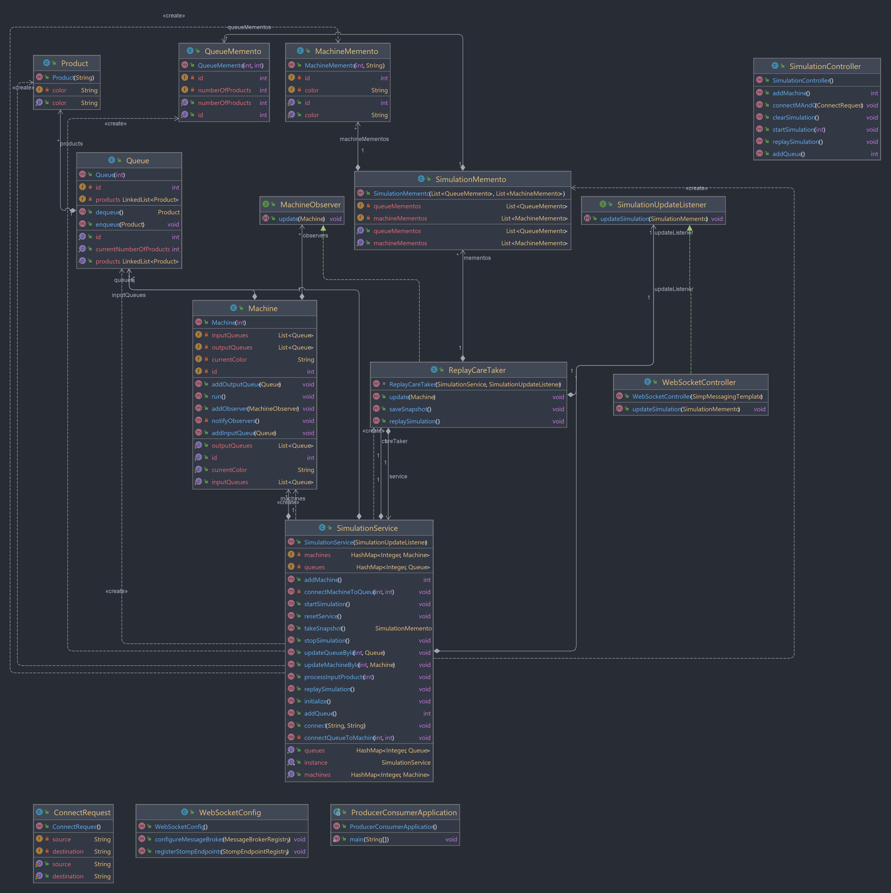
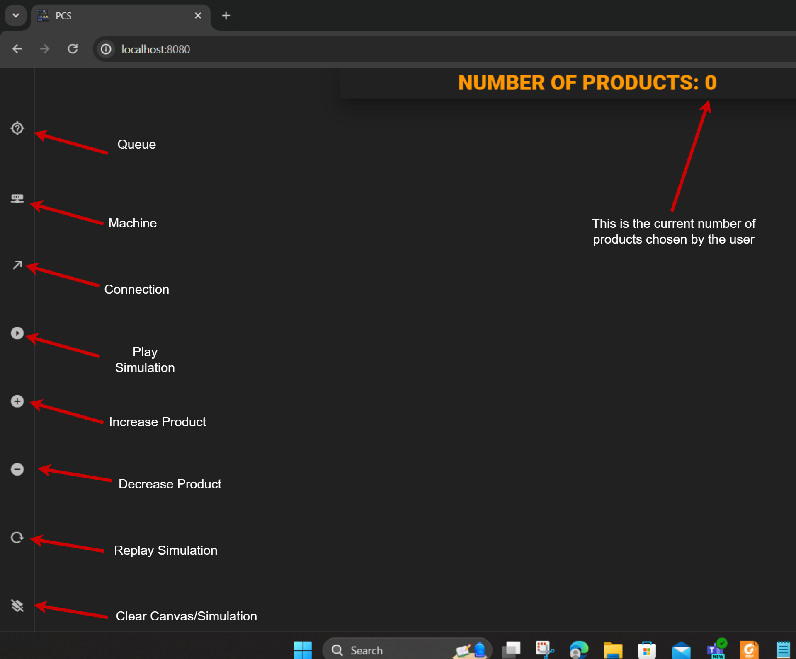
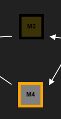

# Assignment #5

## Producer/Consumer Simulation Program

- **OOP and Design Pattern’s course lab**
- [/Producer-Consumer: Github Respository Link](https://github.com/Elshaarawy-1/Producer-Consumer)
- Program Demonstration Video Link: [https://drive.google.com/file/d/1ioYGPEyGE5MSr3_xBlS4wWmcujf97XRS/view](https://drive.google.com/file/d/1ioYGPEyGE5MSr3_xBlS4wWmcujf97XRS/view)

Team Members:

| Name | ID |
| --- | --- |
| [Ahmed Youssef Sobhy Elgoerany](https://github.com/ahmedyoussefg) | 21010217 |
| [Ahmed Mustafa Elmorsy Amer](https://github.com/Elshaarawy-1) | 21010189 |
| [Ali Hassan Ali Mohamed](https://github.com/alihassann191) | 21010837 |
| [Moustafa Esam El-Sayed Amer](https://github.com/MoustafaAmer12) | 21011364 |

---


https://github.com/Elshaarawy-1/Producer-Consumer/assets/108885178/e4cb5ac3-76a6-4ed0-b3f9-00063795e75d


## ****1. Introduction****

The Producer/Consumer Simulation Program is designed to model an assembly line production system consisting of processing machines (**`Ms`**) and queues (**`Qs`**). The program simulates the movement of products between different processing stages, considering random input rates, service times, and visual representation of the simulation. This report provides an overview of the program, including its features, implementation details, design patterns applied, design decisions, and user instructions.

## 2. **Application Features**

### 2.1 **Randomization**

- Random service times for machines.
- Random RGB colors assigned to products.

### 2.2 **Dynamic Machine and Queue Creation**

- Users can add processing machines and queues through the UI.
- Arbitrary connections can be established between machines and queues.

### 2.3 **Simulation Lifecycle**

- Users initiate the simulation by specifying the number of products to be processed.

### 2.4 **Real-time Updates:**

- The UI will dynamically display the number of elements in the queues, and machines will flash when they finish servicing a product.
- Different colors are used to represent products in the simulation.
- Real-time updates from the backend are facilitated through WebSocket communication.

### 2.5 **Replay Functionality**

- After a simulation concludes, users can replay the entire simulation with the same random service times of the first simulation.
- The user can replay the simulation as many as he wants.
- **`ReplayManager`** captures snapshots during the simulation for subsequent replay.

### 2.6 **Clear Simulation**

- Users can reset the simulation, clearing all queues and machines to start fresh.

### 2.7 **Same Drawing with Different Number Of Products**

- After finishing the simulation, users can play the simulation of the same machines, queues and connections once again with different number of products without having to draw it all back.

## 3. **Snapshots of UI**

- **Canvas:**

.png)

 ****

- **Drawing the Qs and Ms and their connections:**

.png)

.png)

- **During Simulation/Replay:**

.png)

## 4. **UML Class Diagram**

- The UML class diagram depicts the main classes and their relationships in the simulation program. Key classes include **`Machine`**, **`Queue`**, **`SimulationService`**, **`WebSocketController`**, and others, illustrating the structure of the simulation model.



### 4.1 **`Machine`** Class:

- Machines process products concurrently on separate threads.
- Observers are notified when a machine finishes processing a product, and the UI is updated accordingly.

### 4.2 **`Queue`** Class:

- Queues implement the Producer/Consumer pattern for handling product movement between different processing stages.

### 4.3 **`ReplayCareTaker`** Class:

- Acts as an observer that gets notified when change happens to a machine, so that it updates and captures snapshots of the simulation state during runtime.
- Acts as a Memento Caretaker that stores snapshots for replaying simulations.

### 4.4 **`SimulationService`** Class:

- Implements the Singleton pattern for managing the simulation state.
- Acts as Originator in Memento Design Pattern that takes snapshots.
- Connects machines and queues, processes input products, and starts/stops the simulation.

### 4.5 WebSocket Integration:

- WebSocket communication is established using Spring's WebSocket support (**`WebSocketConfig`**, **`WebSocketController`**).
- Real-time updates during simulation or replay are sent to the frontend through WebSocket communication.

## 5. **Design Patterns Applied**

- Concurrency patterns are used to help manage the complexity of multi-threaded or parallel programming. They address issues such as synchronization, thread safety, and resource sharing, enabling us to write more efficient and robust concurrent code.

### 5.1 **Singleton Design Pattern**

- Ensures a single instance of the **`SimulationService`** class to manage the simulation state.
- The **`SimulationService`** is initialized through Spring's context and provides centralized control over the simulation.

### 5.2 **Memento Design Pattern**

- Captures snapshots of the simulation state for replay functionality.
- Originator: **`SimulationService`**
- Caretaker: **`ReplayManager`** which ****stores snapshots for replaying simulations.
- Memento: **`SimulationMemento`** which integrates **`MachineMemento`** and **`QueueMemento`**.

Memento classes (**`MachineMemento`**, **`QueueMemento`**, **`SimulationMemento`**) store and retrieve the state of machines, queues, and the entire simulation.

### 5.3 **Observer Design Pattern**

- Facilitates the capturing of simulation snapshots during runtime and send real time update to the front end.
- Observer: **`ReplayManager`** gets notified when change happens to a machine, so that it updates, and captures snapshots of the simulation state during runtime, then sends the current snapshot to the frontend using **`WebSocketController`**.
- Subject: **`Machine`**

### 5.4 **Guarded Suspension Design Pattern**

- The project incorporates the Guarded Suspension pattern in the **`Machine`** class to manage the readiness of machines to process products.
- The **`isReady`** flag is used to guard the suspension of a machine's thread until it is ready to process a product.
- The **`wait()`** and **`notify()`** mechanisms ensure proper synchronization, allowing machines to wait when not ready and resume processing when they become ready.

### 5.5 **Implementation of Producer Consumer Design Pattern**

- Implemented the Producer/Consumer pattern using multiple threads for processing machines (**`Machine`** class) to simulate a production line.
- Each machine runs on a separate thread, and the synchronization is handled using **`synchronized`** blocks.

## 6. **Implementation Details**

The implementation is divided into backend (Spring Boot - Java) and frontend (Vue.js) components.

### 6.1 **Backend (Spring Boot)**

- Utilizes WebSocket communication for real-time updates.
- Applies the Singleton, Memento, and Observer design patterns.
- Concurrency patterns are used to help manage the complexity of multi-threaded or parallel programming.
- Features a **`SimulationService`** class managing the simulation state.

### 6.2 **Front end (Vue.js)**

- Implements a responsive and interactive user friendly interface.
- Consumes WebSocket updates for real-time simulation representation.
- Dynamically displays machine and queue components based on user interactions.
- Dynamically display arrows showing connections between components based on user interactions.
- Handles logical errors without the need to get request from the back end.

### 6.3 WebSocket Integration:

- This program incorporates WebSocket communication to enable real-time updates between the backend (Spring Boot) and frontend (Vue.js). This integration facilitates the exchange of simulation snapshots (Mementos) between the server and the client.
- **WebSocket Configuration (Backend):**
    - The **`WebSocketConfig`** class configures the WebSocket message broker, allowing communication between the backend and frontend.
    - It sets up the **`/topic/ws`** endpoint for broadcasting simulation updates.
- **WebSocket Controller (Backend):**
    - The **`WebSocketController`** class acts as a bridge between the backend and frontend.
    - Real-time updates are sent to the frontend using the **`SimpMessagingTemplate`**, providing a seamless user experience.
- **WebSocket Integration (Frontend):**
    - The Vue.js frontend subscribes to the **`/topic/ws/simulation`** endpoint to receive simulation updates.
    - When a simulation event occurs, such as the completion of a processing step, the backend sends the updated Memento to the frontend, where the colours of working machines will be changed with the colour corresponding to the product processed inside the machine, and the current number of products inside each queue will be updated.

## 7. **Design Decisions and Assumptions**

- **Queue and Machine Connections Assumption:**
    - Queues cannot be connected to other queues, and machines cannot be directly connected to other machines. Connections are allowed only between machines and queues.
- **Queue Assumption:**
    - The simulation assumes the presence of an input queue (**`Q0`**), serving as the starting point for product processing.
    - The simulation assumes the presence of output queue(s) for each machine.
- **Number of Products Limitation:**
    - The chosen number of products should be less than or equal to 16,777,216, representing the total number of possible colour combinations.
- **Machine Colouring Decision:** Default Machine colouring is `#808080` (grey) with an orange stroke, this implies that the machine is currently unoccupied. When stroke is black, this means that the machine is occupied with a product with the same colour as the machine now.

## 8. **Step-by-step User Installation**

### Prerequisites:

Before starting the installation process, ensure that you have the following prerequisites installed on your machine:

1. **Java Development Kit (JDK):**
    - Install the latest version of JDK. You can download it from Oracle JDK or use OpenJDK.
2. **Node.js and npm:**
    - Install Node.js and npm from [Node.js official website](https://nodejs.org/).
3. **Vue CLI:**
    - Install Vue.js CLI globally using the following command:
        
        ```bash
        npm install -g @vue/cli
        ```
        
4. **Git:**
    - Install Git from [Git official website](https://git-scm.com/).

### Backend (Spring Boot - Java):

1. **Clone the Repository:**
    
    ```bash
    git clone https://github.com/Elshaarawy-1/Producer-Consumer
    ```
    
2. **Build and Run the Spring Boot Application:**
- You can either run the Spring Boot Application using IDE like Intellij or you can:
    
    ```bash
    cd Producer-Consumer/back-end/producer-consumer
    ./mvnw spring-boot:run
    ```
    
    This will download dependencies, build the application, and start the Spring Boot server.
    
1. **Verify Backend Setup:**
    - Open a web browser and navigate to **`http://localhost:8081`** to ensure that the backend is running.

### Frontend (Vue.js):

1. **Navigate to Frontend Directory:**
    
    ```bash
    cd Producer-Consumer/front-end
    ```
    
2. **Install Dependencies:**
    
    ```bash
    npm install
    ```
    
3. **Run the Vue.js Application:**
    
    ```bash
    npm run serve
    ```
    
    This command will start the development server.
    
4. **Verify Frontend Setup:**
    - Open a web browser and go to **`http://localhost:8080`** to access the Vue.js frontend.

## 9. **User Manual and How-to Guide**

- Now that the application is running, you can read this guide.
- Video Guide:
    
    [https://drive.google.com/file/d/1ioYGPEyGE5MSr3_xBlS4wWmcujf97XRS/view](https://drive.google.com/file/d/1ioYGPEyGE5MSr3_xBlS4wWmcujf97XRS/view)
    



- Default Machine colouring is `#808080` (grey) with an orange stroke, this implies that the machine is currently unoccupied. When stroke is black, this means that the machine is occupied with a product with the same colour as the machine now.

→ So, in the following screenshot M4 doesn’t serve any product, while M3 has product of colour brown, aka `#3E3104` (using colour picker).  .



## 10. **Conclusion**

The Producer/Consumer Simulation Program offers a comprehensive simulation experience with a focus on visual representation, real-time updates, and dynamic user interaction. The integration of design patterns ensures a flexible and maintainable codebase, providing valuable insights into queuing systems in a manufacturing context.
